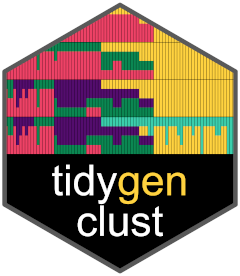

# tidygenclust 

<!-- badges: start -->

[](https://github.com/EvolEcolGroup/tidygenclust/actions/workflows/R-CMD-check.yaml)
[](https://app.codecov.io/gh/EvolEcolGroup/tidygenclust)

<!-- badges: end -->

`tidygenclust` provides functions and methods to run genetic clustering
in R, using the commonly used ADMIXTURE program as we as the python
package `fastmixture`. It also help to align and compare multiple runs
of the same or different K using the functionalities of the python
package `clumppling`. `tidygenclust` builds on `tidypopgen`, enhancing
the grammar of population genetics with a focus on genetic clustering.

## Installation

Currently installation is limited to Linux and OSX, but NOT Windows (you
can use the WSL). You can install the development version of
`tidygenclust` from [GitHub](https://github.com/) with:

``` r
# install.packages("pak")
pak::pak("EvolEcolGroup/tidygenclust")
```

**Note for MacOS user**

We use `reticulate` to seamlessly integrate the required python packages
and dependencies
into R without additional installation steps for the user. 
However, for this to work correctly for **MacOS users**, you need 
`llvm` installed via `brew` in the first place. In `bash`, you will need:\

``` bash
brew install llvm libomp
```

## Overview of functionality

On overview of the functionality of `tidygenclust` and its integration
with `tidypopgen` is provided in the "Get Started"" vignette. This also
includes a detailed description of how to align multiple runs of
clustering and compare them.
